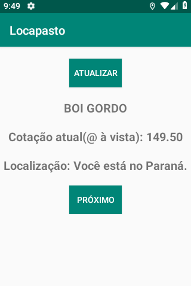
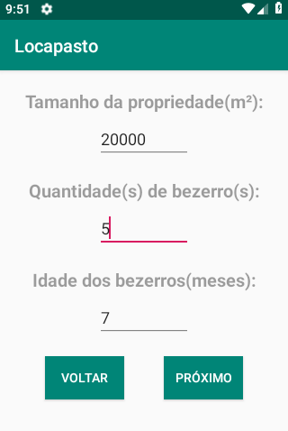
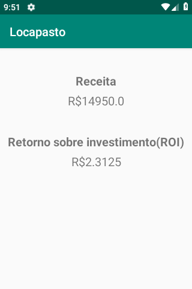

# Locapasto
App para locação de pasto ocioso

## Cotação baixada do site https://canalrural.uol.com.br/cotacao/boi-gordo/ com biblioteca jsoup ([jsoup.org](jsoup.org))

## Baixe a apresentação que utilizamos no Pitch [AQUI!](https://github.com/vinithedev/gado-king/raw/master/locapasto.pptx)

  1                        |  2             		       |  3
:-------------------------:|:-------------------------:|:-------------------------:
  |  |  
